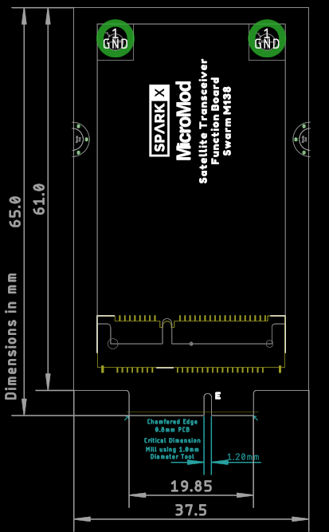
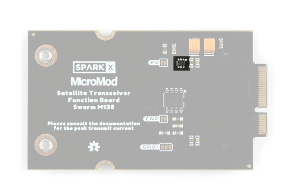

## Overview

The SparkX Satellite Transceiver Function Board - Swarm M138 is quite a simple board. The following is a summary of its features and functions:

* **`Power`** - Power for the Swarm M138 modem is drawn from the MicroMod **VCC** pins
    * The modem requires 3.0VMin, 5.0VMax
    * **VCC** will be 5.0V when the MicroMod Main Board is powered via USB-C
    * **VCC** will be between 3.6V and 4.2V when the MicroMod Main Board is drawing power from a LiPo battery
* **`High-Side Power Switch`** - Power for the Swarm M138 modem is connected via a MIC94064 High-Side Power Switch
    * By default, the modem power is turned off
    * Modem power can be enabled by pulling the **PWR_EN** pin high
        * **PWR_EN** is connected to the MicroMod Processor - the exact pin depends on which Main Board and Processor Board are being used. See the [table below](#example-pin-connection-table) for example pins
    * Modem power can be disabled by pulling the **PWR_EN** pin low or leaving it unconnected
    * The **EN** split pad jumper can be soldered closed to permanently enable modem power
* **`TX and RX`** - The M138 modem uses 3.3V serial (UART) to communicate at 115200 baud (8 data bits, 1 stop bit, no parity)
    * **TXO** and **RXI** are connected to UART pins on the MicroMod Processor
* **`GPIO1`** - The modem's **GPIO1** pin can perform several functions
    * **GPIO1** is connected to a GPIO pin on the MicroMod Processor - the exact pin depends on which Main Board and Processor Board are being used. See the [table below](#example-pin-connection-table) for example pins
    * **GPIO1** can be configured as a "wake from sleep mode" input
    * **GPIO1** can be configured as a "unread messages", "unsent messages" or "sleep mode active" output
    * When configured as an output, **GPIO1** is "open drain". A configurable pull-up resistor provides the high logic level
* **`TX/RX`** - The modem's TX/RX pin indicates if the modem is transmitting or receiving
    * **TX/RX** is connected to a GPIO pin on the MicroMod Processor - the exact pin depends on which Main Board and Processor Board are being used. See the [table below](#example-pin-connection-table) for example pins
    * **TX/RX** is high when the modem is transmitting, low when receiving
* **`EEPROM`** - Like all MicroMod Function Boards, a small EEPROM is provided
    * The Processor Board can read the EEPROM to discover which Function Boards are connected

## Board Dimensions

The board dimensions are illustrated in the drawing below. The listed measurements are in mm. The two mounting holes and two stand-offs are compatible with M2.5 screws.

[{ width="200" }](./board_files/Dimensions.png) 
*Board dimensions. (Click to enlarge)*

## M.2 Connector Pinout

The pinout of the function board's M.2 edge connector (gold fingers) is defined in the following table.

Note that the M.2 connector pins on opposing sides are offset from each other as indicated by the bottom pins where it says "(Not Connected)".

There is no connection to pins that have a "-" under the primary function.

<table style="font-size:12.25px; width:100%">
    <tr>
        <th colspan="2" style="text-align:center; vertical-align:middle; min-width:2rem;" width="40.0%">
            Function
        </th>
        <th style="text-align:center; vertical-align:middle; min-width:1rem;" width="10.0%">
            Bottom 
            Pin
        </th>
        <th style="text-align:center; vertical-align:middle; min-width:1rem;" width="10.0%">
            Top 
            Pin
        </th>
        <th colspan="2" style="text-align:center; vertical-align:middle; min-width:2rem;" width="40.0%">
            Function
        </th>
    </tr>
    <tr>
        <td style="vertical-align:middle" align="center"></td>
        <td style="vertical-align:middle" align="center">(Not Connected)</td>
        <td style="vertical-align:middle" align="center"></td>
        <td style="vertical-align:middle" align="center"><b>75</b></td>
        <td style="vertical-align:middle" align="center" bgcolor="#0000000">GND</td>
        <td style="vertical-align:middle" align="center"></td>
    </tr>
    <tr>
        <td style="vertical-align:middle" align="center"></td>
        <td style="vertical-align:middle" align="center" bgcolor="#ea4335">VCC</td>
        <td style="vertical-align:middle" align="center"><b>74</b></td>
        <td style="vertical-align:middle" align="center"><b>73</b></td>
        <td style="vertical-align:middle" align="center" bgcolor="#ea4335">3.3V</td>
        <td style="vertical-align:middle" align="center"></td>
    </tr>
    <tr>
        <td style="vertical-align:middle" align="center"></td>
        <td style="vertical-align:middle" align="center" bgcolor="#ea4335">VCC</td>
        <td style="vertical-align:middle" align="center"><b>72</b></td>
        <td style="vertical-align:middle" align="center"><b>71</b></td>
        <td style="vertical-align:middle" align="center" bgcolor="#ea4335">PWR_EN</td>
        <td style="vertical-align:middle" align="center"><b>Power Enable</b> Pull high to enable power</td>
    </tr>
    <tr>
        <td style="vertical-align:middle" align="center"></td>
        <td style="vertical-align:middle" align="center">-</td>
        <td style="vertical-align:middle" align="center"><b>70</b></td>
        <td style="vertical-align:middle" align="center"><b>69</b></td>
        <td style="vertical-align:middle" align="center">-</td>
        <td style="vertical-align:middle" align="center"></td>
    </tr>
    <tr>
        <td style="vertical-align:middle" align="center"></td>
        <td style="vertical-align:middle" align="center">-</td>
        <td style="vertical-align:middle" align="center"><b>68</b></td>
        <td style="vertical-align:middle" align="center"><b>67</b></td>
        <td style="vertical-align:middle" align="center">-</td>
        <td style="vertical-align:middle" align="center"></td>
    </tr>
    <tr>
        <td style="vertical-align:middle" align="center"></td>
        <td style="vertical-align:middle" align="center">-</td>
        <td style="vertical-align:middle" align="center"><b>66</b></td>
        <td style="vertical-align:middle" align="center"><b>65</b></td>
        <td style="vertical-align:middle" align="center">-</td>
        <td style="vertical-align:middle" align="center"></td>
    </tr>
    <tr>
        <td style="vertical-align:middle" align="center"></td>
        <td style="vertical-align:middle" align="center">-</td>
        <td style="vertical-align:middle" align="center"><b>64</b></td>
        <td style="vertical-align:middle" align="center"><b>63</b></td>
        <td style="vertical-align:middle" align="center">-</td>
        <td style="vertical-align:middle" align="center"></td>
    </tr>
    <tr>
        <td style="vertical-align:middle" align="center"></td>
        <td style="vertical-align:middle" align="center">-</td>
        <td style="vertical-align:middle" align="center"><b>62</b></td>
        <td style="vertical-align:middle" align="center"><b>61</b></td>
        <td style="vertical-align:middle" align="center">-</td>
        <td style="vertical-align:middle" align="center"></td>
    </tr>
    <tr>
        <td style="vertical-align:middle" align="center"></td>
        <td style="vertical-align:middle" align="center">-</td>
        <td style="vertical-align:middle" align="center"><b>60</b></td>
        <td style="vertical-align:middle" align="center"><b>59</b></td>
        <td style="vertical-align:middle" align="center">-</td>
        <td style="vertical-align:middle" align="center"></td>
    </tr>
    <tr>
        <td style="vertical-align:middle" align="center"></td>
        <td style="vertical-align:middle" align="center">-</td>
        <td style="vertical-align:middle" align="center"><b>58</b></td>
        <td style="vertical-align:middle" align="center"><b>57</b></td>
        <td style="vertical-align:middle" align="center">-</td>
        <td style="vertical-align:middle" align="center"></td>
    </tr>
    <tr>
        <td style="vertical-align:middle" align="center"></td>
        <td style="vertical-align:middle" align="center">-</td>
        <td style="vertical-align:middle" align="center"><b>56</b></td>
        <td style="vertical-align:middle" align="center"><b>55</b></td>
        <td style="vertical-align:middle" align="center">-</td>
        <td style="vertical-align:middle" align="center"></td>
    </tr>
    <tr>
        <td style="vertical-align:middle" align="center"></td>
        <td style="vertical-align:middle" align="center">-</td>
        <td style="vertical-align:middle" align="center"><b>54</b></td>
        <td style="vertical-align:middle" align="center"><b>53</b></td>
        <td style="vertical-align:middle" align="center">TX/RX</td>
        <td style="vertical-align:middle" align="center"><b>Modem State</b> Transmit (High) Receive (Low)</td>
    </tr>
    <tr>
        <td style="vertical-align:middle" align="center"></td>
        <td style="vertical-align:middle" align="center">-</td>
        <td style="vertical-align:middle" align="center"><b>52</b></td>
        <td style="vertical-align:middle" align="center"><b>51</b></td>
        <td style="vertical-align:middle" align="center">-</td>
        <td style="vertical-align:middle" align="center"></td>
    </tr>
    <tr>
        <td style="vertical-align:middle" align="center"></td>
        <td style="vertical-align:middle" align="center">-</td>
        <td style="vertical-align:middle" align="center"><b>50</b></td>
        <td style="vertical-align:middle" align="center"><b>49</b></td>
        <td style="vertical-align:middle" align="center">-</td>
        <td style="vertical-align:middle" align="center"></td>
    </tr>
    <tr>
        <td style="vertical-align:middle" align="center"></td>
        <td style="vertical-align:middle" align="center">-</td>
        <td style="vertical-align:middle" align="center"><b>48</b></td>
        <td style="vertical-align:middle" align="center"><b>47</b></td>
        <td style="vertical-align:middle" align="center">GPIO1</td>
        <td style="vertical-align:middle" align="center"><b>Modem GPIO1</b> I/O pin</td>
    </tr>
    <tr>
        <td style="vertical-align:middle" align="center"></td>
        <td style="vertical-align:middle" align="center">-</td>
        <td style="vertical-align:middle" align="center"><b>46</b></td>
        <td style="vertical-align:middle" align="center"><b>45</b></td>
        <td style="vertical-align:middle" align="center" bgcolor="#0000000">GND</td>
        <td style="vertical-align:middle" align="center"></td>
    </tr>
    <tr>
        <td style="vertical-align:middle" align="center"></td>
        <td style="vertical-align:middle" align="center">-</td>
        <td style="vertical-align:middle" align="center"><b>44</b></td>
        <td style="vertical-align:middle" align="center"><b>43</b></td>
        <td style="vertical-align:middle" align="center">-</td>
        <td style="vertical-align:middle" align="center"></td>
    </tr>
    <tr>
        <td style="vertical-align:middle" align="center"></td>
        <td style="vertical-align:middle" align="center">-</td>
        <td style="vertical-align:middle" align="center"><b>42</b></td>
        <td style="vertical-align:middle" align="center"><b>41</b></td>
        <td style="vertical-align:middle" align="center">-</td>
        <td style="vertical-align:middle" align="center"></td>
    </tr>
    <tr>
        <td style="vertical-align:middle" align="center">Write Protect</td>
        <td style="vertical-align:middle" align="center">EEPROM WP</td>
        <td style="vertical-align:middle" align="center"><b>40</b></td>
        <td style="vertical-align:middle" align="center"><b>39</b></td>
        <td style="vertical-align:middle" align="center" bgcolor="#0000000">GND</td>
        <td style="vertical-align:middle" align="center"></td>
    </tr>
    <tr>
        <td style="vertical-align:middle" align="center"></td>
        <td style="vertical-align:middle" align="center">-</td>
        <td style="vertical-align:middle" align="center"><b>38</b></td>
        <td style="vertical-align:middle" align="center"><b>37</b></td>
        <td style="vertical-align:middle" align="center">-</td>
        <td style="vertical-align:middle" align="center"></td>
    </tr>
    <tr>
        <td style="vertical-align:middle" align="center"></td>
        <td style="vertical-align:middle" align="center">EEPROM A0</td>
        <td style="vertical-align:middle" align="center"><b>36</b></td>
        <td style="vertical-align:middle" align="center"><b>35</b></td>
        <td style="vertical-align:middle" align="center">-</td>
        <td style="vertical-align:middle" align="center"></td>
    </tr>
    <tr>
        <td style="vertical-align:middle" align="center"></td>
        <td style="vertical-align:middle" align="center">EEPROM A1</td>
        <td style="vertical-align:middle" align="center"><b>34</b></td>
        <td style="vertical-align:middle" align="center"><b>33</b></td>
        <td style="vertical-align:middle" align="center" bgcolor="#0000000">GND</td>
        <td style="vertical-align:middle" align="center"></td>
    </tr>
    <tr>
        <td style="vertical-align:middle" align="center"></td>
        <td style="vertical-align:middle" align="center">EEPROM A2</td>
        <td style="vertical-align:middle" align="center"><b>32</b></td>
        <td style="vertical-align:middle" align="center"><b>31</b></td>
        <td style="vertical-align:middle" align="center">Module Key</td>
        <td style="vertical-align:middle" align="center"></td>
    </tr>
    <tr>
        <td style="vertical-align:middle" align="center"></td>
        <td style="vertical-align:middle" align="center">Module Key</td>
        <td style="vertical-align:middle" align="center"><b>30</b></td>
        <td style="vertical-align:middle" align="center"><b>29</b></td>
        <td style="vertical-align:middle" align="center">Module Key</td>
        <td style="vertical-align:middle" align="center"></td>
    </tr>
    <tr>
        <td style="vertical-align:middle" align="center"></td>
        <td style="vertical-align:middle" align="center">Module Key</td>
        <td style="vertical-align:middle" align="center"><b>28</b></td>
        <td style="vertical-align:middle" align="center"><b>27</b></td>
        <td style="vertical-align:middle" align="center">Module Key</td>
        <td style="vertical-align:middle" align="center"></td>
    </tr>
    <tr>
        <td style="vertical-align:middle" align="center"></td>
        <td style="vertical-align:middle" align="center">Module Key</td>
        <td style="vertical-align:middle" align="center"><b>26</b></td>
        <td style="vertical-align:middle" align="center"><b>25</b></td>
        <td style="vertical-align:middle" align="center">Module Key</td>
        <td style="vertical-align:middle" align="center"></td>
    </tr>
    <tr>
        <td style="vertical-align:middle" align="center"></td>
        <td style="vertical-align:middle" align="center">Module Key</td>
        <td style="vertical-align:middle" align="center"><b>24</b></td>
        <td style="vertical-align:middle" align="center"><b>23</b></td>
        <td style="vertical-align:middle" align="center">-</td>
        <td style="vertical-align:middle" align="center"></td>
    </tr>
    <tr>
        <td style="vertical-align:middle" align="center"></td>
        <td style="vertical-align:middle" align="center">-</td>
        <td style="vertical-align:middle" align="center"><b>22</b></td>
        <td style="vertical-align:middle" align="center"><b>21</b></td>
        <td style="vertical-align:middle" align="center">EEPROM SCL</td>
        <td style="vertical-align:middle" align="center"></td>
    </tr>
    <tr>
        <td style="vertical-align:middle" align="center"></td>
        <td style="vertical-align:middle" align="center">-</td>
        <td style="vertical-align:middle" align="center"><b>20</b></td>
        <td style="vertical-align:middle" align="center"><b>19</b></td>
        <td style="vertical-align:middle" align="center">EEPROM SDA</td>
        <td style="vertical-align:middle" align="center"></td>
    </tr>
    <tr>
        <td style="vertical-align:middle" align="center"></td>
        <td style="vertical-align:middle" align="center">-</td>
        <td style="vertical-align:middle" align="center"><b>18</b></td>
        <td style="vertical-align:middle" align="center"><b>17</b></td>
        <td style="vertical-align:middle" align="center">-</td>
        <td style="vertical-align:middle" align="center"></td>
    </tr>
    <tr>
        <td style="vertical-align:middle" align="center"></td>
        <td style="vertical-align:middle" align="center">-</td>
        <td style="vertical-align:middle" align="center"><b>16</b></td>
        <td style="vertical-align:middle" align="center"><b>15</b></td>
        <td style="vertical-align:middle" align="center" bgcolor="#4285f4">RXI</td>
        <td style="vertical-align:middle" align="center">Modem UART In</td>
    </tr>
    <tr>
        <td style="vertical-align:middle" align="center"></td>
        <td style="vertical-align:middle" align="center">-</td>
        <td style="vertical-align:middle" align="center"><b>14</b></td>
        <td style="vertical-align:middle" align="center"><b>13</b></td>
        <td style="vertical-align:middle" align="center" bgcolor="#4285f4">TXO</td>
        <td style="vertical-align:middle" align="center">Modem UART Out</td>
    </tr>
    <tr>
        <td style="vertical-align:middle" align="center"></td>
        <td style="vertical-align:middle" align="center">-</td>
        <td style="vertical-align:middle" align="center"><b>12</b></td>
        <td style="vertical-align:middle" align="center"><b>11</b></td>
        <td style="vertical-align:middle" align="center">-</td>
        <td style="vertical-align:middle" align="center"></td>
    </tr>
    <tr>
        <td style="vertical-align:middle" align="center"></td>
        <td style="vertical-align:middle" align="center">-</td>
        <td style="vertical-align:middle" align="center"><b>10</b></td>
        <td style="vertical-align:middle" align="center"><b>9</b></td>
        <td style="vertical-align:middle" align="center">-</td>
        <td style="vertical-align:middle" align="center"></td>
    </tr>
    <tr>
        <td style="vertical-align:middle" align="center"></td>
        <td style="vertical-align:middle" align="center" bgcolor="#0000000">GND</td>
        <td style="vertical-align:middle" align="center"><b>8</b></td>
        <td style="vertical-align:middle" align="center"><b>7</b></td>
        <td style="vertical-align:middle" align="center">-</td>
        <td style="vertical-align:middle" align="center"></td>
    </tr>
    <tr>
        <td style="vertical-align:middle" align="center"></td>
        <td style="vertical-align:middle" align="center">-</td>
        <td style="vertical-align:middle" align="center"><b>6</b></td>
        <td style="vertical-align:middle" align="center"><b>5</b></td>
        <td style="vertical-align:middle" align="center">-</td>
        <td style="vertical-align:middle" align="center"></td>
    </tr>
    <tr>
        <td style="vertical-align:middle" align="center"></td>
        <td style="vertical-align:middle" align="center">-</td>
        <td style="vertical-align:middle" align="center"><b>4</b></td>
        <td style="vertical-align:middle" align="center"><b>3</b></td>
        <td style="vertical-align:middle" align="center">-</td>
        <td style="vertical-align:middle" align="center"></td>
    </tr>
    <tr>
        <td style="vertical-align:middle" align="center"></td>
        <td style="vertical-align:middle" align="center" bgcolor="#0000000">GND</td>
        <td style="vertical-align:middle" align="center"><b>2</b></td>
        <td style="vertical-align:middle" align="center"><b>1</b></td>
        <td style="vertical-align:middle" align="center" bgcolor="#0000000">GND</td>
        <td style="vertical-align:middle" align="center"></td>
    </tr>
</table>

*For more details, users can reference the [schematic](./board_files/Schematic.pdf).*

## Example Pin Connection Table

The pin connections depend on which [MicroMod](https://www.sparkfun.com/micromod) Main Board and Processor Board are being used.

The table below provides an example for the [Artemis Processor Board](https://www.sparkfun.com/products/16401) and the [Main Board - Double](https://www.sparkfun.com/products/18576).

<table  style="font-size:12.25px;width:100%">
    <tr>
        <th rowspan="2" style="text-align:center; vertical-align:middle; min-width:2rem;" width="40.0%">
            Satellite Function Board 
            Pin Name
        </th>
        <th rowspan="2" style="text-align:center; vertical-align:middle; min-width:1rem;" width="20.0%">
            Processor 
            I/O 
            Direction
        </th>
        <th colspan="2" style="text-align:center; vertical-align:middle;min-width:2rem;" width="40.0%">
            Main Board's 
            Processor Pin
        </th>
    </tr>
    <tr>
        <th style="text-align:center; vertical-align:middle; min-width:1rem;" width="20.0%">
            Slot 0
        </th>
        <th style="text-align:center; vertical-align:middle; min-width:1rem;" width="20.0%">
            Slot 1
        </th>
    </tr>
    <tr>
        <td style="vertical-align:middle" align="center" bgcolor="#ea4335">VCC</td>
        <td style="vertical-align:middle" align="center">Power</td>
        <td style="vertical-align:middle" align="center" bgcolor="#ea4335">VCC</td>
        <td style="vertical-align:middle" align="center" bgcolor="#ea4335">VCC</td>
    </tr>
    <tr>
        <td style="vertical-align:middle" align="center" bgcolor="#0000000">GND</td>
        <td style="vertical-align:middle" align="center">Power</td>
        <td style="vertical-align:middle" align="center" bgcolor="#0000000">GND</td>
        <td style="vertical-align:middle" align="center" bgcolor="#0000000">GND</td>
    </tr>
    <tr>
        <td style="vertical-align:middle" align="center" bgcolor="#ea4335">PWR_EN</td>
        <td style="vertical-align:middle" align="center">O</td>
        <td style="vertical-align:middle" align="center">PWR_EN0 (SDIO_DATA2)</td>
        <td style="vertical-align:middle" align="center">PWR_EN1 (SDIO_DATA1)</td>
    </tr>
    <tr>
        <td style="vertical-align:middle" align="center" bgcolor="#4285f4">TXO</td>
        <td style="vertical-align:middle" align="center">I</td>
        <td style="vertical-align:middle" align="center" bgcolor="#4285f4">RX1</td>
        <td style="vertical-align:middle" align="center" bgcolor="#4285f4">RX2</td>
    </tr>
    <tr>
        <td style="vertical-align:middle" align="center" bgcolor="#4285f4">RXI</td>
        <td style="vertical-align:middle" align="center">O</td>
        <td style="vertical-align:middle" align="center" bgcolor="#4285f4">TX1</td>
        <td style="vertical-align:middle" align="center" bgcolor="#4285f4">TX2</td>
    </tr>
    <tr>
        <td style="vertical-align:middle" align="center">GPIO1</td>
        <td style="vertical-align:middle" align="center">I/O</td>
        <td style="vertical-align:middle" align="center">D0</td>
        <td style="vertical-align:middle" align="center">D1</td>
    </tr>
    <tr>
        <td style="vertical-align:middle" align="center">TX/RX</td>
        <td style="vertical-align:middle" align="center">I</td>
        <td style="vertical-align:middle" align="center">G0</td>
        <td style="vertical-align:middle" align="center">G5</td>
    </tr>
</table>

## Power Control (High-Side Power Switch)

Power for the Swarm M138 modem is drawn from the MicroMod **VCC** pins. The modem requires 3.0VMin, 5.0VMax.

**VCC** will be 5.0V when the MicroMod Main Board is powered via USB-C, and between 3.6V and 4.2V when the MicroMod Main Board is drawing power from a LiPo battery.

Power for the Swarm M138 modem is connected via a MIC94064 High-Side Power Switch.

Modem power can be disabled by pulling the **PWR_EN** pin low or leaving it unconnected. By default, the modem power is turned off. 

Modem power can be enabled by pulling the **PWR_EN** pin high. **PWR_EN** is connected to the MicroMod Processor - the exact pin depends on which Main Board and Processor Board are being used.
See the [table above](#example-pin-connection-table) for example pins.

If required, the **EN** split pad jumper can be soldered closed to permanently enable modem power.

    
[{ width="200" }](./img/hookup_guide/high_side_switch.png) 
*The high-side power switch. (Click to enlarge)*

## Current Consumption

The modem's average current draw and peak draw during transmit depend on the supply voltage **VCC**.
For more details, please consult the [Satellite Transceiver Breakout - Swarm M138 - Hookup Guide](https://learn.sparkfun.com/tutorials/satellite-transceiver-breakout---swarm-m138---hookup-guide#current-draw).

When the **PWR_EN** pin is pulled low, the modem is powered off completely. The MIC94064 has a very low quiescent current of 2&micro;A.

## Jumpers

There are three jumpers on the back of the board that can be used to modify how the board functions.

* **GPIO1** - This is a double-jumper which connects pull-up and/or pull-down resistors to the modem's GPIO1 pin.
    * By default, the 100K pull-up resistor is connected so that a logic high is output when GPIO1 is in one of its "open drain" output modes
    * The pull-up can be disconnected by opening the closed half of the jumper
    * A 100K pull-down can be connected by closing the open half of the jumper
    * Both pull-up and pull-down can be connected to bias GPIO1 with 1.65V when it is configured as an analog input
* **EN** - This jumper can be closed to connect a 100K pull-up resistor to the high-side power switch's enable pin (**PWR_EN**)
    * Closing the jumper will cause the modem to be powered continuously
    * Some MicroMod Processor Boards do not have a GPIO pin connected to **PWR_EN**. If you are using one of these boards, solder the **EN** jumper closed to power the modem
* **EWP** - This jumper can be closed to disable the EEPROM write protection
    * By default, the EEPROM is write protected. The **WP** pin is pulled up by a 100K resistor
    * Soldering the **EWP** jumper closed will pull **WP** low, disabling write protection

!!! note
    
Never modified a jumper before? Check out our <a href="https://learn.sparkfun.com/tutorials/664">Jumper Pads and PCB Traces tutorial</a> for a quick introduction!

    

        <a href="https://learn.sparkfun.com/tutorials/664">How to Work with Jumper Pads and PCB Traces 
        </a>
    

[{ width="200" }](./img/hookup_guide/jumpers.png) 
*The jumpers on the back of the function board. (Click to enlarge)*

