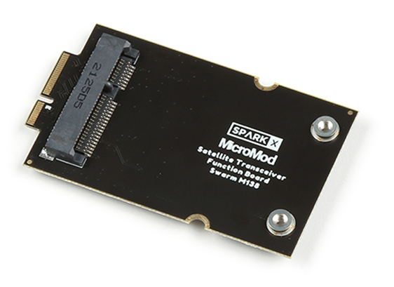

  
  
  
  

# SparkX Satellite Transceiver Function Board - Swarm M138

The [SparkX Satellite Transceiver Function Board - Swarm M138 (SPX-20107)](https://www.sparkfun.com/products/20107) is an adapter board which allows you to add Swarm Satellite connectivity
to your [MicroMod](https://www.sparkfun.com/micromod) project. It is designed to be plugged into the [MicroMod Main Board - Single](https://www.sparkfun.com/products/18575)
or [MicroMod Main Board - Double](https://www.sparkfun.com/products/18576). You can then install the Swarm M138 satellite modem and communicate using our dedicated 
[Swarm Satellite Arduino Library](https://github.com/sparkfun/SparkFun_Swarm_Satellite_Arduino_Library).

!!! note
    **The Swarm M138 modem is not included with the function board.** You will need to purchase the [Satellite Transceiver Breakout - Swarm M138 (SPX-19236)](https://www.sparkfun.com/products/19236) separately to obtain the modem, antenna and ground plane.

 
### [SparkX Swarm MicroMod Function Board (SPX-20107)](https://www.sparkfun.com/products/20107)

